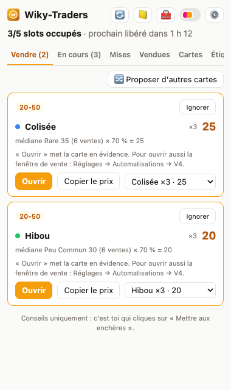
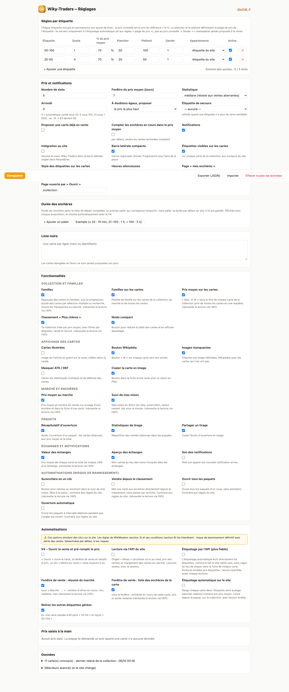
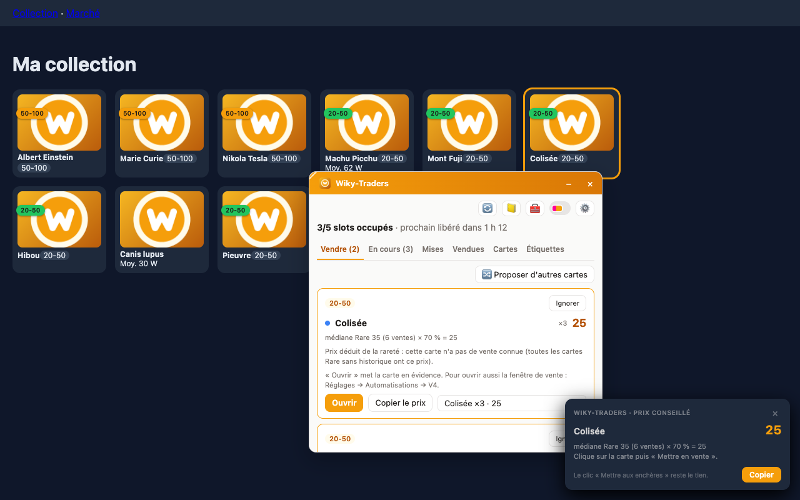
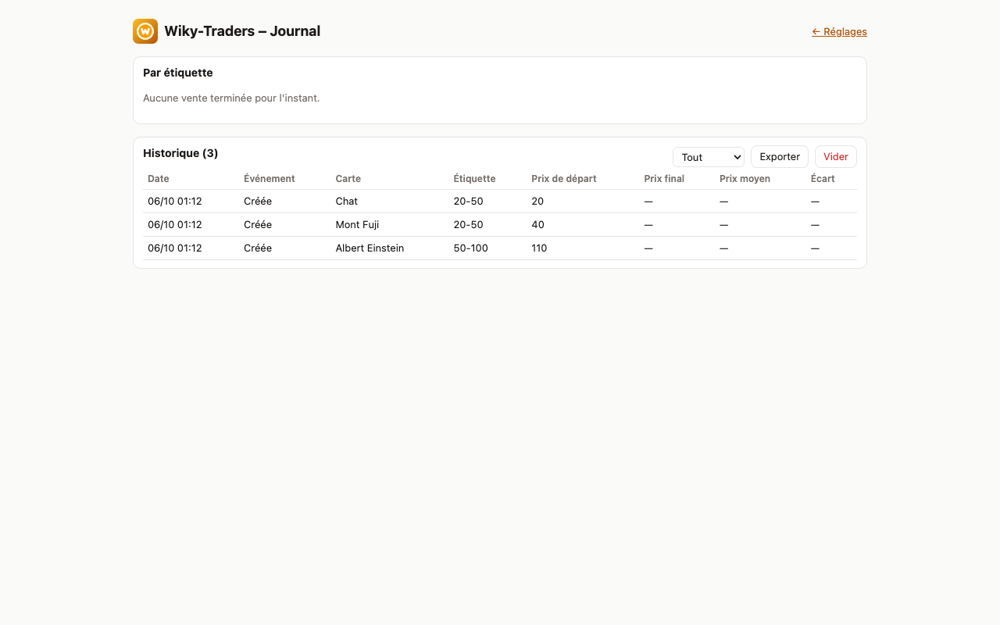

# Wiky-Traders

> Copilote d'enchères pour [WikiMasters](https://www.wiki-masters.com) : une extension navigateur qui garde tes slots d'enchères remplis selon tes règles, calcule le bon prix… et te laisse cliquer.


<!-- TODO: bannière / capture principale -->
<!--  -->

---

## Sommaire

- [Pourquoi un copilote et pas un bot](#pourquoi-un-copilote-et-pas-un-bot)
- [Ce que fait l'extension](#ce-que-fait-lextension)
- [Captures d'écran](#captures-décran)
- [Installation](#installation)
- [Utilisation](#utilisation)
- [Configuration](#configuration)
- [Architecture](#architecture)
- [Développement](#développement)
- [Feuille de route](#feuille-de-route)
- [Confidentialité](#confidentialité)
- [Avertissement](#avertissement)

---

## Pourquoi un copilote et pas un bot

Les [règles de la communauté](https://www.wiki-masters.com/rules) (section 3) et les [conditions d'utilisation](https://www.wiki-masters.com/terms) (section 6) de WikiMasters interdisent les bots, scripts et macros qui jouent ou échangent à ta place, sous peine de bannissement.

Wiky-Traders fait donc **tout le travail de réflexion** (quel slot est libre, quelle carte vendre, à quel prix) mais **c'est toi qui cliques sur « Mettre en vente »**. Tu gardes l'essentiel du gain de temps sans automatiser l'action interdite.

| L'extension | Toi |
| --- | --- |
| Lit tes enchères en cours et tes étiquettes quand tu es sur le site | Ouvres le site |
| Détecte les slots libres et l'heure de fin de chaque enchère | Cliques sur la notification |
| Choisit la carte à vendre selon ta répartition | Valides ou changes la carte proposée |
| Calcule le prix (moyenne × % de l'étiquette) | Cliques sur « Mettre en vente » |
| T'alerte quand un slot se libère | |

## Ce que fait l'extension

Exemple de répartition : **1 carte « 50-100 » + 4 cartes « 20-50 »**, chacune à **70 % de son prix moyen**.

- **Règles par étiquette** : quota de slots, % du prix moyen, prix plancher/plafond, nombre d'exemplaires à garder, étiquette de secours. Les favoris et une liste noire ne sont jamais proposés.
- **Détection des slots libres** : relevé des enchères en cours, alarme locale à chaque fin d'enchère, notification et badge sur l'icône (ex. « 2 »).
- **Choix de la carte** : priorité aux cartes ayant le plus de doublons, puis au prix calculé le plus haut (ou le plus bas pour écouler).
- **Calcul du prix** :

  ```
  prix = min(plafond, max(plancher, arrondi(prix moyen × %)))
  ```

  Moyenne (ou médiane) sur 7 jours glissants, arrondi à la dizaine, détail toujours visible : « moyenne 86 × 70 % = 60 ».
- **File de mise en vente** : une ligne par slot à remplir avec les actions *Ouvrir*, *Changer de carte*, *Ignorer*, et un bouton pour copier le prix.
- **Journal** : historique des ventes proposées, créées et terminées pour ajuster tes pourcentages.

La spécification complète est dans [`docs/specs.md`](docs/specs.md).

## Captures d'écran

> 🚧 À venir — les captures seront ajoutées dans [`docs/screenshots/`](docs/screenshots/).

| Popup | Page d'options |
| --- | --- |
| <!--  --> _à venir_ | <!--  --> _à venir_ |

| Overlay page de vente | Journal |
| --- | --- |
| <!--  --> _à venir_ | <!--  --> _à venir_ |

<!-- TODO: GIF de démo (notification → popup → page de vente → clic) -->
<!--  -->

## Installation

> 🚧 À compléter quand la V0 sera disponible.

### Depuis une release (recommandé)

<!-- TODO: lien vers les releases / Chrome Web Store / Firefox Add-ons -->

1. Télécharger l'archive `wiky-traders-x.y.z.zip` depuis les [releases](../../releases).
2. _À compléter_

### Depuis les sources

```bash
git clone git@github.com:AndyB31/Wiky-Traders.git
cd Wiky-Traders
npm install
npm run build
```

Puis, selon le navigateur :

- **Chrome / Edge / Brave** : ouvrir `chrome://extensions`, activer le *Mode développeur*, cliquer sur *Charger l'extension non empaquetée* et choisir le dossier `dist/`.
- **Firefox** : ouvrir `about:debugging#/runtime/this-firefox`, *Charger un module temporaire* et choisir `dist/manifest.json`.

<!-- TODO: vérifier les commandes une fois le projet initialisé -->

## Utilisation

> 🚧 À compléter.

1. Se connecter sur [wiki-masters.com](https://www.wiki-masters.com).
2. Ouvrir la page de sa **collection** pour que l'extension relève cartes et étiquettes.
3. Ouvrir la page de ses **enchères** pour relever les enchères en cours.
4. Régler ses règles par étiquette dans la page d'options.
5. Quand un slot se libère : cliquer sur la notification → *Ouvrir* → coller le prix → **Mettre en vente**.

<!-- TODO: captures pas à pas -->

## Configuration

> 🚧 À compléter.

| Réglage | Défaut | Description |
| --- | --- | --- |
| Nombre de slots | 5 | Nombre d'enchères simultanées |
| Fenêtre du prix moyen | 7 jours | Période prise en compte |
| Moyenne / médiane | moyenne | La médiane résiste mieux aux ventes aberrantes |
| Arrondi | 10 | Pas d'arrondi du prix |
| Heures silencieuses | — | Pas de notification sur cette plage (ex. 23 h – 8 h) |

Les réglages peuvent être exportés / importés en JSON depuis la page d'options.

## Architecture

Extension **Manifest V3 sans serveur** : tout est calculé et stocké dans le navigateur (`chrome.storage.local`), la seule action sur le site est ton clic.

```
content script (lit le DOM) → service worker (décide) → popup (propose) → toi (cliques)
```

| Module | Rôle |
| --- | --- |
| `parsers/` | Lire enchères, collection, étiquettes et prix depuis le DOM (sélecteurs centralisés dans `selectors.ts`) |
| `allocation.ts` | Manque par étiquette et classement des cartes vendables |
| `pricing.ts` | Prix moyen/médian, %, plancher, plafond, arrondi |
| `alarms.ts` | Alarmes de fin d'enchère, notifications et badge |
| `ui/` | Popup, page d'options, overlay, journal |

- Permissions : `storage`, `alarms`, `notifications` ; accès hôte limité à `https://www.wiki-masters.com/*`.
- Compatible Chrome, Edge, Brave et Firefox.
- Si un sélecteur ne trouve rien (mise à jour du site), l'extension affiche « page non reconnue » plutôt que des données fausses.

## Développement

> 🚧 À compléter.

```bash
npm install      # dépendances
npm run dev      # build en mode watch
npm run build    # build de production dans dist/
npm test         # tests unitaires
```

<!-- TODO: structure du projet, conventions, mise à jour des sélecteurs -->

## Feuille de route

- [ ] **V0 – Lecture** : relevé des enchères, de la collection et des étiquettes ; affichage des slots dans la popup
- [ ] **V1 – Règles et prix** : page d'options, calcul du manque, choix de carte, prix conseillé
- [ ] **V2 – Alertes** : alarmes, notifications, badge, overlay sur la page de vente
- [ ] **V3 – Journal** : historique et statistiques
- [ ] **V4 – Pré-remplissage** : uniquement avec l'accord écrit des développeurs de WikiMasters

## Confidentialité

- Aucun appel réseau sortant, aucune donnée envoyée ailleurs.
- Toutes les données restent dans le stockage local du navigateur et peuvent être effacées depuis la page d'options.

## Avertissement

Projet personnel, non affilié à WikiMasters. L'extension est conçue pour respecter les règles du site (aucune action sans clic humain), mais son utilisation reste sous ta responsabilité.
