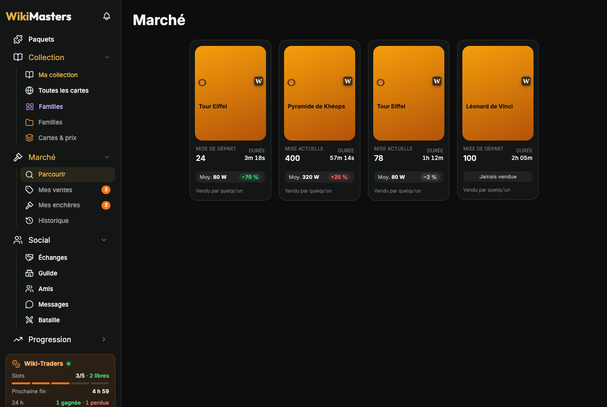
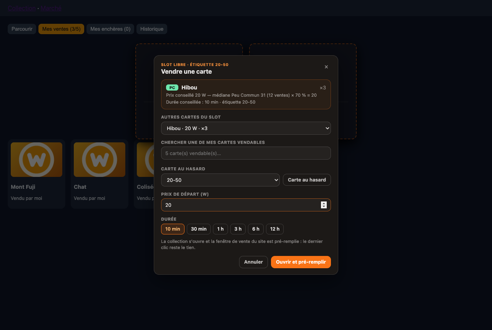

# Wiki-Traders

> Copilote d'enchères pour [WikiMasters](https://www.wiki-masters.com) : une extension navigateur qui garde tes slots d'enchères remplis selon tes règles, calcule le bon prix… et te laisse cliquer.


📖 **Documentation complète : [docs/wiki](docs/wiki/README.md)** (installation, premiers pas, chaque réglage, dépannage).

---

## Sommaire

- [Pourquoi un copilote et pas un bot](#pourquoi-un-copilote-et-pas-un-bot)
- [Fonctionnalités](#fonctionnalités)
- [Installation pas à pas](#installation-pas-à-pas)
- [Configuration pas à pas](#configuration-pas-à-pas)
- [Au quotidien](#au-quotidien)
- [Référence des réglages](#référence-des-réglages)
- [Dépannage](#dépannage)
- [Architecture](#architecture)
- [Développement](#développement)
- [Confidentialité](#confidentialité)
- [Avertissement](#avertissement)

---

## Pourquoi un copilote et pas un bot

Les [règles de la communauté](https://www.wiki-masters.com/rules) (section 3) et les [conditions d'utilisation](https://www.wiki-masters.com/terms) (section 6) de WikiMasters interdisent les bots, scripts et macros qui jouent ou échangent à ta place, sous peine de bannissement.

Par défaut, Wiki-Traders fait **tout le travail de réflexion** (quel slot est libre, quelle carte vendre, à quel prix) mais **c'est toi qui cliques sur « Mettre aux enchères »**.

| L'extension | Toi |
| --- | --- |
| Lit tes enchères, ta collection et tes étiquettes | Ouvres le site |
| Détecte les slots libres et l'heure de fin de chaque enchère | Cliques sur la notification |
| Choisit la carte à vendre selon ta répartition | Valides ou changes la carte proposée |
| Calcule le prix (prix de référence × % de l'étiquette) | Cliques sur « Mettre aux enchères » |

Quelques options **facultatives et désactivées par défaut** (pré-remplissage, mode enchère, étiquetage automatique, surenchère en un clic, vente depuis le classement, ouverture des paquets, lecture de l'API) vont plus loin : elles demandent une confirmation et sont signalées comme contraires aux règles. Voir [Automatisations et risques](docs/wiki/Automatisations-et-risques.md).

## Fonctionnalités

| | |
| --- | --- |
| **Intégré au site** | Barre latérale rangée en arborescence (Paquets en haut ; menus Collection, Marché, Social, Progression ; pages de l'extension à l'icône orange), **récapitulatif** toujours visible (slots occupés / libres, prochaine fin, gagnées / perdues sur 24 h, synchro) avec la liste des **mises en direct** relue toutes les 2 s, Paramètres tout en bas avec un onglet **Wiki-Traders**. |
| **Vendre** | Slots par étiquette (quota, % du prix, plancher / plafond, exemplaires à garder, liste noire, favoris jamais proposés), prix et durée conseillés avec le détail du calcul. Dans Marché → **Mes ventes**, un clic sur un slot libre ouvre « Vendre » : carte proposée, autre carte, recherche ou **carte au hasard** d'une étiquette. **Mode enchère** sur la collection : un clic sur une carte ouvre sa mise en vente pré-remplie. |
| **Marché enrichi** | Sur chaque enchère : **prix moyen de la carte et écart** (vert = bonne affaire). **Mes enchères** : tes mises, en cours ou historique. **Historique** : tes ventes, statistiques, filtres vendues / invendues, écart à la moyenne. |
| **Page d'une enchère** | **Historique des prix** de la carte : chiffres clés (ventes, moyenne, médiane, extrêmes, tendance 30 j, taux de vente), graphique en **points, bougies ou ligne**, moyenne glissante de 2 j à 1 mois, filtre vendues / sans acheteur ; **autres enchères de la même carte**. |
| **Prix comme le site** | « Moy. » = moyenne des ventes de la carte dans sa rareté, comme le site ; prix de 150 cartes par requête, toutes les ventes lues (pagination), cache 6 h, bouton **↻ Rafraîchir les prix**. |
| **Familles** | Regroupe des cartes, progression, valeur et coût pour compléter, ajout par **sélection multiple** (mode « Sélectionner » du site) ou recherche au fil de la frappe, marché des manquantes ; import depuis une autre extension. |
| **Étiquettes** | Pastilles sur les cartes ; **étiquetage automatique** par plage de prix à partir du prix moyen de chaque carte (bouton **Étiquettes** sur la collection). |
| **Échanges** | Valeur de chaque côté et **bilan pour toi** (« −500 W : tu donnes 600 W, tu reçois 100 W »), aperçus des cartes. |
| **Et aussi** | Classement « Plus chères », mode compact, cartes illustrées, bouton Wikipédia, images manquantes, copie de carte en image, récapitulatif et statistiques de paquets, son des notifications, journal des ventes, notifications de fin d'enchère. |
| **Mises à jour** | Vérification de la branche `main` (démarrage, toutes les 6 h) et **mise à jour en un clic** depuis les réglages. |

| Barre latérale | Historique des prix | Marché |
| --- | --- | --- |
|  |  |  |

| Mes ventes : vendre un slot | Familles | Mode enchère |
| --- | --- | --- |
|  |  |  |

> Les pages du site visibles sur les captures sont une imitation servie par `npm run demo` (le vrai site exige d'être connecté). L'interface de l'extension est réelle.

## Installation pas à pas

L'extension n'est pas publiée sur les boutiques : on la construit depuis les sources puis on la charge « non empaquetée ». Compte 5 minutes.

### 1. Prérequis

- [Node.js](https://nodejs.org) **20 ou plus récent** (vérifie avec `node -v`) ;
- [Git](https://git-scm.com) ;
- un navigateur **Chromium** (Chrome, Edge, Brave, Arc, Opera…) ou **Firefox 128+**.

### 2. Récupérer et construire l'extension

```bash
git clone https://github.com/AndyB31/Wiki-Traders.git
cd Wiki-Traders
make install
```

`make install` vérifie Node.js, installe les dépendances, construit l'extension, **demande où l'installer** (par défaut `~/Wiki-Traders`), propose la mise à jour en un clic et affiche comment la charger dans ton navigateur. Sans question : `make install DEST=~/Wiki-Traders`. `make help` liste les autres commandes (`make update`, `make zip`…).

Sans `make` : `npm install && npm run build`, puis charge le dossier **`dist/`**. (`npm run zip` produit en plus `wiki-traders.zip`.)

> Le navigateur reconnaît une extension non empaquetée à son **dossier** : garde toujours le même (un nouveau dossier = nouvelle extension, sans tes réglages ; Réglages → Avancé → Exporter / Importer pour les reprendre).

### 3. Charger l'extension dans le navigateur

**Chrome, Edge, Brave, Opera**

1. Ouvre la page des extensions : `chrome://extensions` (Edge : `edge://extensions`, Brave : `brave://extensions`).
2. Active le **Mode développeur** (interrupteur en haut à droite).
3. Clique sur **Charger l'extension non empaquetée** et choisis le dossier `dist/`.

**Arc**

1. Ouvre `arc://extensions` (ou `chrome://extensions`).
2. Active le **Mode développeur**, puis **Load unpacked** → dossier `dist/`.
3. Vérifie que la carte « Wiki-Traders » indique bien *Loaded from: …/Wiki-Traders/dist*.

**Firefox (128+)**

1. Ouvre `about:debugging#/runtime/this-firefox`.
2. Clique sur **Charger un module complémentaire temporaire** et choisis `dist/manifest.json`.
3. Firefox oublie les modules temporaires à la fermeture : recommence à chaque démarrage.

La page de réglages s'ouvre à l'installation. Épingle l'icône 🧩 → Wiki-Traders dans la barre d'outils pour l'avoir sous la main.

### 4. Vérifier que tout marche

1. Va sur [wiki-masters.com](https://www.wiki-masters.com) et connecte-toi.
2. Ouvre (ou recharge) un onglet du site : le bloc orange **Wiki-Traders** apparaît dans la barre latérale, au-dessus de *Paramètres*.
3. Ouvre ta **collection** : les étiquettes s'affichent sur les cartes et l'interrupteur **Mode enchère** apparaît à côté du titre.

Rien n'apparaît ? Voir [Dépannage](#dépannage).

> **Tu utilises une autre extension WikiMasters ?** Wiki-Traders importe ses familles au premier lancement (et ses statistiques de tirage à la demande). Si elle propose les mêmes fonctions, désactive-la ensuite pour éviter les doublons (prix, « Plus chères », Familles…).

### 5. Mettre à jour

**En un clic** : installe une fois le programme d'aide (`make install` le propose, sinon `make updater`). Quand `main` a des nouveautés, le récapitulatif affiche **« ↑ Mise à jour disponible »** ; Réglages → **Mises à jour** → **Mettre à jour** récupère la dernière version, reconstruit, recharge l'extension et les onglets WikiMasters.

**À la main** : `make update` (ou `git pull && npm install && npm run build`), puis **↻** sous Wiki-Traders dans la page des extensions et **recharge les onglets WikiMasters** (une extension rechargée ne remplace pas le script d'une page déjà ouverte). Tes réglages et données sont conservés.

**Sans le dépôt** : le dernier zip construit est publié à chaque mise à jour de `main` dans la release [« Dernière version »](https://github.com/AndyB31/Wiki-Traders/releases/tag/latest) : décompresse-le dans le **même dossier** qu'avant, puis ↻.

### 6. Désinstaller

*Supprimer* dans la page des extensions. Pour effacer d'abord les données : Réglages → *Effacer toutes les données*.

## Configuration pas à pas

Les réglages sont dans **Paramètres → onglet Wiki-Traders** sur le site (ou clic droit sur l'icône → *Options*). La page commence par un **Démarrage rapide** qui coche ce qui est prêt et règle le reste en un clic ; chaque section s'explique avec un exemple. **Enregistrer** (ou Ctrl/⌘ + S) quand tu as fini.

1. **Règles par étiquette** : une ligne par étiquette de ta collection. Par défaut : 1 slot « 50-100 » et 4 slots « 20-50 », à **70 %** du prix de référence, en gardant 1 exemplaire. Les étiquettes trouvées dans ta collection s'ajoutent en un clic.
2. **Nombre de slots** : le nombre d'enchères simultanées permises par le site (lu automatiquement dans « Mes ventes (2/5) »).
3. **Prix** : statistique (*médiane* conseillée), fenêtre (7 jours), arrondi (automatique), ordre à doublons égaux, étiquette de secours.
4. **Durée des enchères** : ajoute des paliers, ex. ≤ 20 → 10 min, 21–100 → 1 h, > 100 → 3 h.
5. **Notifications** et **heures silencieuses** (23 h – 8 h par défaut).
6. **Affichage sur le site** : intégration au site, barre latérale compacte, étiquettes sur les cartes (libellés ou pastilles).
7. **Liste noire** et **prix saisis à la main** si besoin.
8. **Fonctionnalités** : coche celles que tu veux (prix sur les cartes, familles, classement, paquets, échanges…) — voir [Fonctionnalités](docs/wiki/Fonctionnalites.md).
9. **Automatisations** (facultatif, désactivé par défaut, voir l'avertissement) : **lecture via l'API** (nécessaire aux prix, familles, mises, marché…), pré-remplissage, étiquetage automatique.
10. **Mises à jour** : version installée, nouveautés, bouton « Mettre à jour ».

Enfin, **ouvre ta collection** puis l'onglet **Historique** du Marché une fois : l'extension apprend tes cartes et les prix réels.

Le détail de chaque option est dans la documentation : [Premiers pas](docs/wiki/Premiers-pas.md) et [Référence des réglages](docs/wiki/Reglages.md).

## Au quotidien

- Le **récapitulatif** de la barre latérale résume tout (slots, prochaine fin, mises en direct) ; un clic ouvre **Vendre**.
- **Marché → Mes ventes** : tes ventes et les slots libres ; clic sur un slot → carte, prix, durée → mise en vente (ou carte ouverte avec le prix pré-rempli).
- **Marché → Parcourir** : la moyenne et l'écart sur chaque enchère montrent les bonnes affaires ; sur la page d'une enchère, l'**historique des prix** et les autres enchères de la carte.
- Dans la fenêtre « Mettre aux enchères » du site, un **toast** rappelle le prix conseillé ; dessous, les enchères en cours de la même carte.
- Sur la **collection** : **Mode enchère** (un clic sur une carte ouvre sa mise en vente), **Plus chères**, **Étiquettes**.
- L'icône de l'extension ouvre ou ferme **Vendre** sur le site ; le **journal** (Outils → 📒) aide à ajuster tes pourcentages.

Guide complet : [Vendre](docs/wiki/Vendre.md), [Mises et ventes](docs/wiki/Mises-et-ventes.md), [Intégration au site](docs/wiki/Integration-au-site.md).

## Référence des réglages

| Réglage | Défaut | Description |
| --- | --- | --- |
| Nombre de slots | 5 | Enchères simultanées (mis à jour par le site) |
| Fenêtre du prix moyen | 7 jours | Période des ventes prises en compte |
| Statistique du prix conseillé | médiane | Résiste aux ventes énormes ; les badges « Moy. » affichent la moyenne de la carte, comme le site |
| Arrondi | automatique | Unité sous 20, 5 sous 100, 10 sous 1 000, 50 au-delà (ou pas fixe) |
| À doublons égaux | prix le plus haut | Ou le plus bas (écouler), ou aléatoire |
| Étiquette de secours | aucune | Reprend le slot d'une étiquette sans carte vendable |
| Proposer une carte déjà en vente | non | |
| Enchères en cours dans le prix moyen | non | Par défaut seules les ventes terminées comptent |
| Durée des enchères | durée du site | Paliers prix → durée |
| Notifications / heures silencieuses | oui / 23 h – 8 h | |
| Intégration au site | oui | Barre latérale, fenêtres, pages, onglet Paramètres |
| Barre latérale compacte | oui | Menus Social et Progression |
| Étiquettes visibles sur les cartes | oui, libellés | Ou pastilles de couleur |
| Fenêtre de vente : résumé du marché / liste des enchères | oui | Nécessite la lecture via l'API |
| Lecture via l'API | **non** | Mises, ventes conclues, marché, ventes en cours relues chaque minute |
| V4 – pré-remplissage (et Mode enchère) | **non** | Ouvre la vente, remplit prix et durée |
| Étiquetage automatique / par l'API | **non** | Range les cartes par plage de prix |
| Fonctionnalités | voir la page | Une case par fonctionnalité ; les automatisations sont désactivées par défaut |
| Mises à jour | vérification automatique | Toutes les 6 h ; « Mettre à jour » nécessite le programme d'aide |

Les réglages s'exportent et s'importent en JSON (Réglages → Avancé).

## Dépannage

| Problème | Solution |
| --- | --- |
| Rien n'apparaît sur le site | Recharge l'onglet WikiMasters après avoir rechargé l'extension ; vérifie le dossier chargé (`dist/`) et qu'une seule copie est installée. |
| L'ancienne interface est toujours là | Même chose : recharge la page du site (Cmd/Ctrl + R). |
| « Aucune carte connue » | Ouvre ta collection une fois. |
| Slots / ventes pas à jour | Clique ↻ dans le bloc Wiki-Traders, ou active la lecture via l'API pour la relève automatique. |
| Un slot reste vide | La fenêtre Vendre explique pourquoi (favoris, déjà en vente, « garder au moins »…). |
| Prix « — » ou faux | « ↻ Rafraîchir les prix » (Étiquettes, Plus chères, légende de la collection) ; « Jamais vendue » = aucune vente connue. |
| Peu de cartes étiquetées | Active la lecture via l'API : l'étiquetage utilise alors le prix moyen de chaque carte (seules les cartes jamais vendues restent sans prix). |
| « Mettre à jour » grisé | Installe le programme d'aide (`make updater`) puis recharge l'extension. « Dépôt introuvable » : le dépôt GitHub est privé. |
| Page « non reconnue » | Outils → **Diagnostic** exporte la structure de la page ; ajuste Réglages → Données → *Sélecteurs avancés* ou ouvre une issue avec le fichier. |

Plus de cas : [Dépannage (documentation)](docs/wiki/Depannage.md).

## Architecture

Extension **Manifest V3 sans serveur** : tout est calculé et stocké dans le navigateur (`chrome.storage.local`).

```
page du site ─ bridge.ts (données React, réponses des appels du site) ─┐
API du site (facultatif, lecture en lot, paginée) ─────────────────────┼─ content script ─ service worker (fusion, alarmes, badge,
                                                                       │                   notifications, vérification des mises à jour)
                                                                       └─ interface dans le site (barre latérale, Marché, pages, fenêtres, toasts) / popup
programme d'aide (facultatif, local) ── git pull + construction, ou zip de la release ── mise à jour en un clic
```

| Fichier | Rôle |
| --- | --- |
| `src/content/bridge.ts` | Script de page : lecture des données React affichées |
| `src/content/parsers/` | Normalisation des données, lecture du texte en secours, sélecteurs (`selectors.ts`) |
| `src/content/site-ui.ts` | Barre latérale en arborescence, récapitulatif, fenêtres, pages, onglet Paramètres |
| `src/content/auction-mode.ts` | Mode enchère de la collection |
| `src/content/toast.ts`, `overlay.ts` | Toasts (prix conseillé, progression), étiquettes sur les cartes |
| `src/content/sell-market.ts` | Résumé du marché et enchères de la carte dans la fenêtre de vente |
| `src/content/api.ts`, `api-tags.ts` | Lecture de l'API du site ; étiquetage par l'API |
| `src/content/catalog.ts`, `net.ts` | Catalogue et prix en lot (cache) ; réponses des appels du site relayées par `bridge.ts` |
| `src/content/features/` | Une fonctionnalité par module, relancés par `runtime.ts` : familles, prix, classement, paquets, échanges, mises en direct (`bid-watch`), onglets du Marché (`market-tabs`, `market-slots`, `market-panels`), écart sur les enchères (`market-deals`), historique des prix (`price-history`), autres enchères (`auction-others`), étiquettes (`tag-tool`)… |
| `src/lib/features.ts`, `families.ts` | Liste des fonctionnalités ; logique des familles (possession, coût, import / export) |
| `src/content/actions.ts`, `automation.ts` | Pré-remplissage, étiquetage par l'interface |
| `src/lib/allocation.ts`, `pricing.ts` | Slots, choix des cartes, prix de référence et prix conseillé |
| `src/lib/journal.ts`, `autotag.ts`, `duration.ts` | Journal, plan d'étiquetage, paliers de durée |
| `src/background/` | Fusion des relevés, alarmes, notifications, badge |
| `src/ui/` | Popup (et ses vues intégrées au site), réglages (`options.ts`), panneau des mises à jour, journal |
| `src/lib/update.ts`, `scripts/updater/` | Vérification des mises à jour (API GitHub) ; programme d'aide (native messaging) et son installation |
| `Makefile`, `.github/workflows/release.yml` | `make install` / `make update` ; construction et zip publié à chaque push sur `main` |

Permissions : `storage`, `alarms`, `notifications`, `nativeMessaging` (programme d'aide aux mises à jour, facultatif) ; accès limité à `https://www.wiki-masters.com/*`.

## Développement

```bash
make help            # toutes les commandes
make install         # dépendances, construction, installation dans un dossier, instructions
make update          # git pull, construction, mise à jour du dossier installé
make test            # TypeScript + tests unitaires (Vitest + jsdom)
make zip             # wiki-traders.zip
npm run dev          # construction en continu dans dist/ (recharger l'extension après modification)
npm run demo         # parcours complet dans Chromium + captures du README
```

`npm run demo` nécessite le navigateur de Playwright : `npx playwright install chromium`. Voir [Développement (documentation)](docs/wiki/Developpement.md).

## Confidentialité

- Aucune donnée personnelle n'est envoyée ailleurs que sur WikiMasters ; pas de serveur Wiki-Traders, pas de statistiques.
- Sans la **lecture via l'API**, l'extension ne fait aucune requête : elle lit seulement ce que la page affiche.
- Avec elle, l'extension interroge l'API du site (celle qu'utilise le site lui-même) **avec ta session, en lecture seule** ; l'étiquetage par l'API, s'il est activé, n'écrit que des étiquettes.
- La vérification des mises à jour interroge l'**API publique de GitHub** (dernier commit de `main`) ; rien de personnel n'est envoyé.
- Le programme d'aide, s'il est installé, ne fait que `git pull` et la construction (ou le téléchargement du zip de la release) sur ton ordinateur.
- Toutes les données restent dans le stockage local du navigateur et s'effacent depuis les réglages.

## Avertissement

Projet personnel, non affilié à WikiMasters. Par défaut, l'extension n'agit pas sans ton clic ; les automatisations facultatives sont contraires aux règles du site et peuvent entraîner un **bannissement**. Leur utilisation reste sous ta responsabilité.
