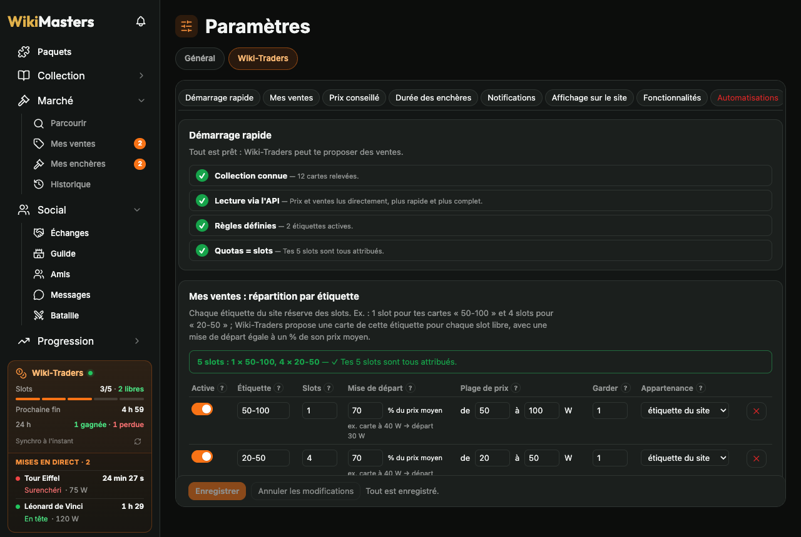
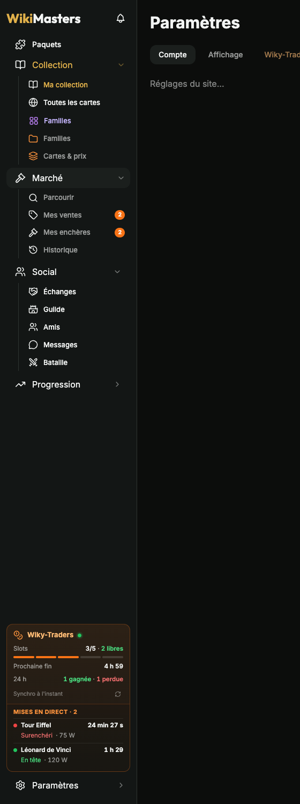
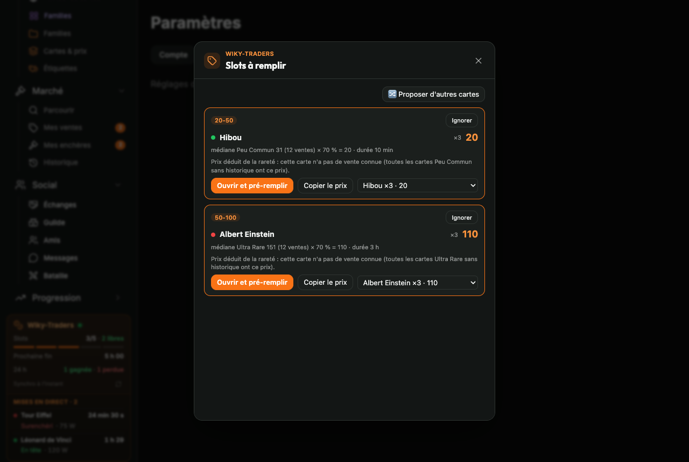

# Wiky-Traders

> Copilote d'enchères pour [WikiMasters](https://www.wiki-masters.com) : une extension navigateur qui garde tes slots d'enchères remplis selon tes règles, calcule le bon prix… et te laisse cliquer.




📖 **Documentation complète : [docs/wiki](docs/wiki/README.md)** (installation, premiers pas, chaque réglage, dépannage).

---

## Sommaire

- [Pourquoi un copilote et pas un bot](#pourquoi-un-copilote-et-pas-un-bot)
- [Fonctionnalités](#fonctionnalités)
- [Installation pas à pas](#installation-pas-à-pas)
- [Configuration pas à pas](#configuration-pas-à-pas)
- [Au quotidien](#au-quotidien)
- [Référence des réglages](#référence-des-réglages)
- [Dépannage](#dépannage)
- [Architecture](#architecture)
- [Développement](#développement)
- [Confidentialité](#confidentialité)
- [Avertissement](#avertissement)

---

## Pourquoi un copilote et pas un bot

Les [règles de la communauté](https://www.wiki-masters.com/rules) (section 3) et les [conditions d'utilisation](https://www.wiki-masters.com/terms) (section 6) de WikiMasters interdisent les bots, scripts et macros qui jouent ou échangent à ta place, sous peine de bannissement.

Par défaut, Wiky-Traders fait **tout le travail de réflexion** (quel slot est libre, quelle carte vendre, à quel prix) mais **c'est toi qui cliques sur « Mettre aux enchères »**.

| L'extension | Toi |
| --- | --- |
| Lit tes enchères, ta collection et tes étiquettes | Ouvres le site |
| Détecte les slots libres et l'heure de fin de chaque enchère | Cliques sur la notification |
| Choisit la carte à vendre selon ta répartition | Valides ou changes la carte proposée |
| Calcule le prix (prix de référence × % de l'étiquette) | Cliques sur « Mettre aux enchères » |

Quelques options **facultatives et désactivées par défaut** (pré-remplissage, mode enchère, étiquetage automatique, surenchère en un clic, vente depuis le classement, ouverture des paquets, lecture de l'API) vont plus loin : elles demandent une confirmation et sont signalées comme contraires aux règles. Voir [Automatisations et risques](docs/wiki/Automatisations-et-risques.md).

## Fonctionnalités

| | |
| --- | --- |
| **Intégré au site** | Barre latérale compacte (menus *Social* et *Progression*), bloc orange **Wiky-Traders** toujours visible : slots occupés / libres, prochaine fin, mises en tête / surenchéries, gagnées / perdues sur 24 h, dernière synchro. Fonctions en fenêtre par-dessus la page ou en page du site, onglet **Wiky-Traders** dans *Paramètres*. |
| **Règles par étiquette** | Quota de slots, % du prix de référence, plancher / plafond, exemplaires à garder, étiquette de secours, liste noire ; les favoris ne sont jamais proposés. |
| **Prix conseillé** | Prix du site, historique de la carte, prix saisi à la main ou médiane de la rareté, × % de l'étiquette, arrondi ; détail toujours affiché (« médiane Rare 36 × 70 % = 25 »). |
| **Durée conseillée** | Paliers de prix → durée (10 min, 1 h, 3 h…). |
| **Alertes** | Badge sur l'icône (slots libres), notification à chaque fin d'enchère, heures silencieuses. |
| **Fenêtre de vente enrichie** | Toast « prix conseillé », résumé du marché de la carte (nombre d'offres, min, médiane, max) et liste de ses enchères en cours. |
| **Mises et ventes** | Tes mises (en tête, surenchérie, gagnée, perdue) et tes ventes conclues, avec l'écart au prix de la carte. |
| **Journal** | Ventes proposées, créées et terminées ; conseils pour ajuster tes %. |
| **Étiquettes sur les cartes** | Pastilles aux couleurs du site sur chaque carte de la collection (libellés ou simples ronds). |
| **Familles** | Regroupe des cartes, progression, valeur et coût pour compléter, ajout par **sélection multiple** depuis la collection ou par recherche au fil de la frappe, marché des manquantes ; tes familles de « Prix moyen collection » sont importées. |
| **Tout « Prix moyen collection », en plus rapide** | Prix moyen sur les cartes, classement « Plus chères », mode compact, cartes illustrées, bouton Wikipédia, images manquantes, copie de carte en image, prix au marché, récapitulatif et statistiques de paquets, valeur des échanges, son des notifications, suivi des mises en direct. Les prix de 150 cartes arrivent en une requête. |

| Familles | Une famille | Barre latérale |
| --- | --- | --- |
|  |  |  |

| Barre latérale | Fenêtre « Vendre » | Mode enchère |
| --- | --- | --- |
|  |  |  |

> Les pages du site visibles sur les captures sont une imitation servie par `npm run demo` (le vrai site exige d'être connecté). L'interface de l'extension est réelle.

## Installation pas à pas

L'extension n'est pas publiée sur les boutiques : on la construit depuis les sources puis on la charge « non empaquetée ». Compte 5 minutes.

### 1. Prérequis

- [Node.js](https://nodejs.org) **20 ou plus récent** (vérifie avec `node -v`) ;
- [Git](https://git-scm.com) ;
- un navigateur **Chromium** (Chrome, Edge, Brave, Arc, Opera…) ou **Firefox 128+**.

### 2. Récupérer et construire l'extension

```bash
git clone https://github.com/AndyB31/Wiky-Traders.git
cd Wiky-Traders
npm install
npm run build
```

Le dossier **`dist/`** contient l'extension prête à charger. (`npm run zip` produit en plus `wiky-traders.zip`.)

### 3. Charger l'extension dans le navigateur

**Chrome, Edge, Brave, Opera**

1. Ouvre la page des extensions : `chrome://extensions` (Edge : `edge://extensions`, Brave : `brave://extensions`).
2. Active le **Mode développeur** (interrupteur en haut à droite).
3. Clique sur **Charger l'extension non empaquetée** et choisis le dossier `dist/`.

**Arc**

1. Ouvre `arc://extensions` (ou `chrome://extensions`).
2. Active le **Mode développeur**, puis **Load unpacked** → dossier `dist/`.
3. Vérifie que la carte « Wiky-Traders » indique bien *Loaded from: …/Wiky-Traders/dist*.

**Firefox (128+)**

1. Ouvre `about:debugging#/runtime/this-firefox`.
2. Clique sur **Charger un module complémentaire temporaire** et choisis `dist/manifest.json`.
3. Firefox oublie les modules temporaires à la fermeture : recommence à chaque démarrage.

La page de réglages s'ouvre à l'installation. Épingle l'icône 🧩 → Wiky-Traders dans la barre d'outils pour l'avoir sous la main.

### 4. Vérifier que tout marche

1. Va sur [wiki-masters.com](https://www.wiki-masters.com) et connecte-toi.
2. Ouvre (ou recharge) un onglet du site : le bloc orange **Wiky-Traders** apparaît dans la barre latérale, au-dessus de *Paramètres*.
3. Ouvre ta **collection** : les étiquettes s'affichent sur les cartes et l'interrupteur **Mode enchère** apparaît à côté du titre.

Rien n'apparaît ? Voir [Dépannage](#dépannage).

> **Tu utilises « WikiMasters – Prix moyen collection » ?** Wiky-Traders reprend toutes ses fonctionnalités et importe tes familles au premier lancement : désactive-la ensuite pour éviter les doublons (prix, « Plus chères », Familles…).

### 5. Mettre à jour

```bash
cd Wiky-Traders
git pull
npm install
npm run build
```

Puis, dans la page des extensions, clique sur **↻ (recharger)** sous Wiky-Traders, et **recharge les onglets WikiMasters** déjà ouverts (une extension rechargée ne remplace pas le script d'une page déjà ouverte). Tes réglages et données sont conservés.

### 6. Désinstaller

*Supprimer* dans la page des extensions. Pour effacer d'abord les données : Réglages → *Effacer toutes les données*.

## Configuration pas à pas

Les réglages sont dans **Paramètres → onglet Wiky-Traders** sur le site (ou clic droit sur l'icône → *Options*). Pense à cliquer sur **Enregistrer** en bas de page.

1. **Règles par étiquette** : une ligne par étiquette de ta collection. Par défaut : 1 slot « 50-100 » et 4 slots « 20-50 », à **70 %** du prix de référence, en gardant 1 exemplaire. Les étiquettes trouvées dans ta collection s'ajoutent en un clic.
2. **Nombre de slots** : le nombre d'enchères simultanées permises par le site (lu automatiquement dans « Mes ventes (2/5) »).
3. **Prix** : statistique (*médiane* conseillée), fenêtre (7 jours), arrondi (automatique), ordre à doublons égaux, étiquette de secours.
4. **Durée des enchères** : ajoute des paliers, ex. ≤ 20 → 10 min, 21–100 → 1 h, > 100 → 3 h.
5. **Notifications** et **heures silencieuses** (23 h – 8 h par défaut).
6. **Affichage sur le site** : intégration au site, barre latérale compacte, étiquettes sur les cartes (libellés ou pastilles).
7. **Liste noire** et **prix saisis à la main** si besoin.
8. **Fonctionnalités** : coche celles que tu veux (prix sur les cartes, familles, classement, paquets, échanges…) — voir [Fonctionnalités](docs/wiki/Fonctionnalites.md).
9. **Automatisations** (facultatif, désactivé par défaut, voir l'avertissement) : lecture via l'API (nécessaire aux prix, familles, mises…), pré-remplissage, étiquetage automatique.

Enfin, **ouvre ta collection** puis l'onglet **Historique** du Marché une fois : l'extension apprend tes cartes et les prix réels.

Le détail de chaque option est dans la documentation : [Premiers pas](docs/wiki/Premiers-pas.md) et [Référence des réglages](docs/wiki/Reglages.md).

## Au quotidien

- Le **bloc Wiky-Traders** de la barre latérale résume tout ; un clic ouvre **Vendre** (les slots à remplir).
- Pour chaque slot libre : une carte, un prix et sa durée. **Ouvrir** amène sur la carte dans la collection ; **Copier le prix**, change de carte dans la liste, ou **Ignorer**.
- Dans la fenêtre « Mettre aux enchères » du site, un **toast** rappelle le prix conseillé ; sous la fenêtre, les enchères en cours de la même carte.
- Avec le **Mode enchère** (collection), un clic sur une carte ouvre directement sa mise en vente, prix et durée remplis.
- L'icône de l'extension ouvre ou ferme la fenêtre **Vendre** sur le site.
- Le **journal** (Outils → 📒) t'aide à ajuster tes pourcentages.

Guide complet : [Vendre](docs/wiki/Vendre.md), [Mises et ventes](docs/wiki/Mises-et-ventes.md), [Intégration au site](docs/wiki/Integration-au-site.md).

## Référence des réglages

| Réglage | Défaut | Description |
| --- | --- | --- |
| Nombre de slots | 5 | Enchères simultanées (mis à jour par le site) |
| Fenêtre du prix moyen | 7 jours | Période des ventes prises en compte |
| Statistique | médiane | La moyenne est tirée par quelques ventes énormes |
| Arrondi | automatique | Unité sous 20, 5 sous 100, 10 sous 1 000, 50 au-delà (ou pas fixe) |
| À doublons égaux | prix le plus haut | Ou le plus bas (écouler), ou aléatoire |
| Étiquette de secours | aucune | Reprend le slot d'une étiquette sans carte vendable |
| Proposer une carte déjà en vente | non | |
| Enchères en cours dans le prix moyen | non | Par défaut seules les ventes terminées comptent |
| Durée des enchères | durée du site | Paliers prix → durée |
| Notifications / heures silencieuses | oui / 23 h – 8 h | |
| Intégration au site | oui | Barre latérale, fenêtres, pages, onglet Paramètres |
| Barre latérale compacte | oui | Menus Social et Progression |
| Étiquettes visibles sur les cartes | oui, libellés | Ou pastilles de couleur |
| Fenêtre de vente : résumé du marché / liste des enchères | oui | Nécessite la lecture via l'API |
| Lecture via l'API | **non** | Mises, ventes conclues, marché, ventes en cours relues chaque minute |
| V4 – pré-remplissage (et Mode enchère) | **non** | Ouvre la vente, remplit prix et durée |
| Étiquetage automatique / par l'API | **non** | Range les cartes par plage de prix |
| Fonctionnalités | voir la page | Une case par fonctionnalité ; les automatisations sont désactivées par défaut |

Les réglages s'exportent et s'importent en JSON (Réglages → bas de page).

## Dépannage

| Problème | Solution |
| --- | --- |
| Rien n'apparaît sur le site | Recharge l'onglet WikiMasters après avoir rechargé l'extension ; vérifie le dossier chargé (`dist/`) et qu'une seule copie est installée. |
| L'ancienne interface est toujours là | Même chose : recharge la page du site (Cmd/Ctrl + R). |
| « Aucune carte connue » | Ouvre ta collection une fois. |
| Slots / ventes pas à jour | Clique ↻ dans le bloc Wiky-Traders, ou active la lecture via l'API pour la relève automatique. |
| Un slot reste vide | La fenêtre Vendre explique pourquoi (favoris, déjà en vente, « garder au moins »…). |
| Page « non reconnue » | Outils → **Diagnostic** exporte la structure de la page ; ajuste Réglages → Données → *Sélecteurs avancés* ou ouvre une issue avec le fichier. |

Plus de cas : [Dépannage (documentation)](docs/wiki/Depannage.md).

## Architecture

Extension **Manifest V3 sans serveur** : tout est calculé et stocké dans le navigateur (`chrome.storage.local`).

```
page du site ─ bridge.ts (données React) ─┐
API du site (facultatif, lecture) ────────┼─ content script ─ service worker (fusion, alarmes, badge, notifications)
                                          └─ interface dans le site (barre latérale, fenêtres, pages, toasts) / popup
```

| Fichier | Rôle |
| --- | --- |
| `src/content/bridge.ts` | Script de page : lecture des données React affichées |
| `src/content/parsers/` | Normalisation des données, lecture du texte en secours, sélecteurs (`selectors.ts`) |
| `src/content/site-ui.ts` | Barre latérale compacte, bloc Wiky-Traders, fenêtres, pages, onglet Paramètres |
| `src/content/auction-mode.ts` | Mode enchère de la collection |
| `src/content/toast.ts`, `overlay.ts` | Toasts (prix conseillé, progression), étiquettes sur les cartes |
| `src/content/sell-market.ts` | Résumé du marché et enchères de la carte dans la fenêtre de vente |
| `src/content/api.ts`, `api-tags.ts` | Lecture de l'API du site ; étiquetage par l'API |
| `src/content/catalog.ts`, `net.ts` | Catalogue et prix en lot (cache) ; réponses des appels du site relayées par `bridge.ts` |
| `src/content/features/` | Une fonctionnalité par module (familles, prix, classement, paquets, échanges, mises…), relancés par `runtime.ts` |
| `src/lib/features.ts`, `families.ts` | Liste des fonctionnalités ; logique des familles (possession, coût, import / export) |
| `src/content/actions.ts`, `automation.ts` | Pré-remplissage, étiquetage par l'interface |
| `src/lib/allocation.ts`, `pricing.ts` | Slots, choix des cartes, prix de référence et prix conseillé |
| `src/lib/journal.ts`, `autotag.ts`, `duration.ts` | Journal, plan d'étiquetage, paliers de durée |
| `src/background/` | Fusion des relevés, alarmes, notifications, badge |
| `src/ui/` | Popup (et ses vues intégrées au site), réglages, journal |

Permissions : `storage`, `alarms`, `notifications` ; accès limité à `https://www.wiki-masters.com/*`.

## Développement

```bash
npm install
npm run dev          # build en mode watch dans dist/ (recharger l'extension après modification)
npm run build        # build de production
npm run typecheck    # TypeScript
npm test             # tests unitaires (Vitest + jsdom)
npm run demo         # parcours complet dans Chromium + captures du README
```

`npm run demo` nécessite le navigateur de Playwright : `npx playwright install chromium`. Voir [Développement (documentation)](docs/wiki/Developpement.md).

## Confidentialité

- Aucune donnée n'est envoyée ailleurs que sur WikiMasters ; pas de serveur Wiky-Traders, pas de statistiques.
- Sans la **lecture via l'API**, l'extension ne fait aucune requête : elle lit seulement ce que la page affiche.
- Avec elle, l'extension interroge l'API du site (celle qu'utilise le site lui-même) **avec ta session, en lecture seule** ; l'étiquetage par l'API, s'il est activé, n'écrit que des étiquettes.
- Toutes les données restent dans le stockage local du navigateur et s'effacent depuis les réglages.

## Avertissement

Projet personnel, non affilié à WikiMasters. Par défaut, l'extension n'agit pas sans ton clic ; les automatisations facultatives sont contraires aux règles du site et peuvent entraîner un **bannissement**. Leur utilisation reste sous ta responsabilité.
