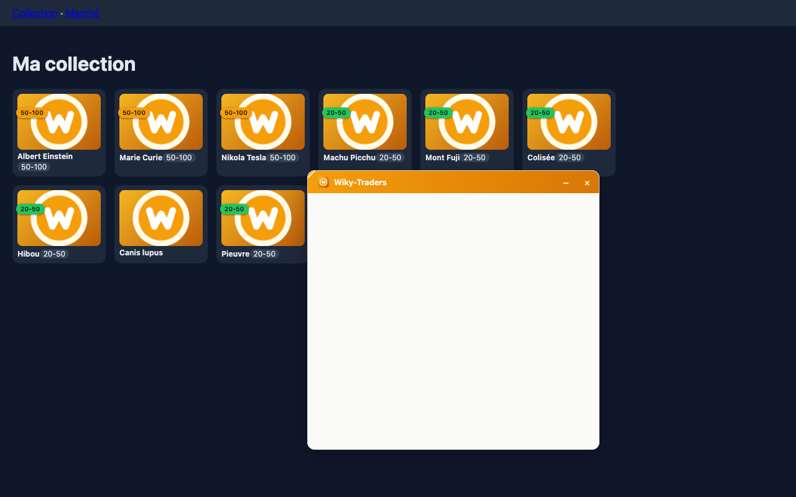
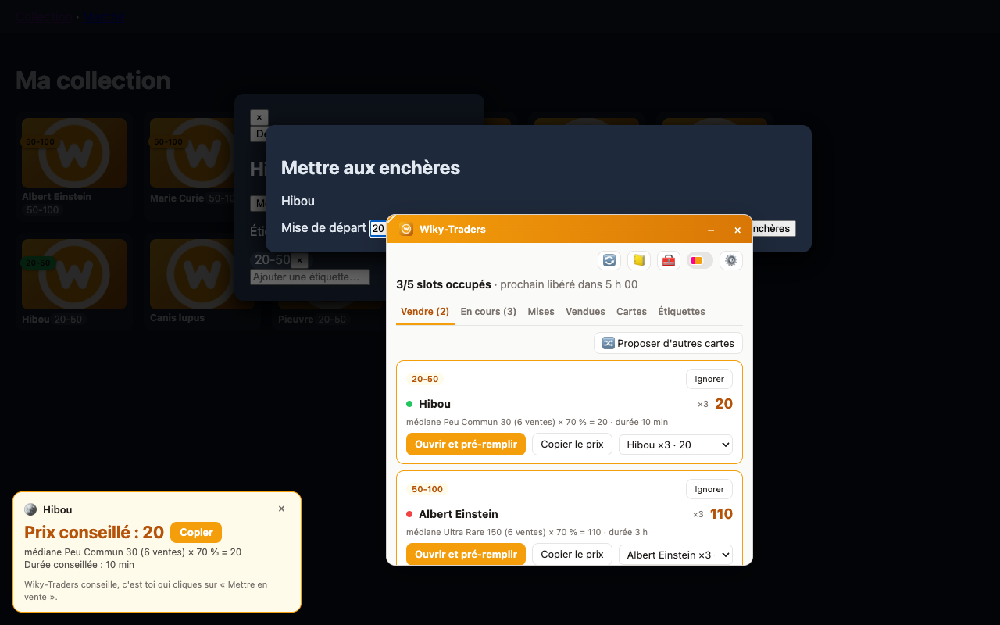

# Wiky-Traders

> Copilote d'enchères pour [WikiMasters](https://www.wiki-masters.com) : une extension navigateur qui garde tes slots d'enchères remplis selon tes règles, calcule le bon prix… et te laisse cliquer.




---

## Sommaire

- [Pourquoi un copilote et pas un bot](#pourquoi-un-copilote-et-pas-un-bot)
- [Ce que fait l'extension](#ce-que-fait-lextension)
- [Captures d'écran](#captures-décran)
- [Installation](#installation)
- [Utilisation](#utilisation)
- [Configuration](#configuration)
- [Architecture](#architecture)
- [Développement](#développement)
- [Feuille de route](#feuille-de-route)
- [Confidentialité](#confidentialité)
- [Avertissement](#avertissement)

---

## Pourquoi un copilote et pas un bot

Les [règles de la communauté](https://www.wiki-masters.com/rules) (section 3) et les [conditions d'utilisation](https://www.wiki-masters.com/terms) (section 6) de WikiMasters interdisent les bots, scripts et macros qui jouent ou échangent à ta place, sous peine de bannissement.

Wiky-Traders fait donc **tout le travail de réflexion** (quel slot est libre, quelle carte vendre, à quel prix) mais **c'est toi qui cliques sur « Mettre en vente »**. Tu gardes l'essentiel du gain de temps sans automatiser l'action interdite.

| L'extension | Toi |
| --- | --- |
| Lit tes enchères en cours et tes étiquettes quand tu es sur le site | Ouvres le site |
| Détecte les slots libres et l'heure de fin de chaque enchère | Cliques sur la notification |
| Choisit la carte à vendre selon ta répartition | Valides ou changes la carte proposée |
| Calcule le prix (moyenne × % de l'étiquette) | Cliques sur « Mettre en vente » |
| T'alerte quand un slot se libère | |

## Ce que fait l'extension

Exemple de répartition : **1 carte « 50-100 » + 4 cartes « 20-50 »**, chacune à **70 % de son prix moyen**.

- **Règles par étiquette** : quota de slots, % du prix moyen, plage de prix plancher/plafond (pour l'étiquetage automatique uniquement), nombre d'exemplaires à garder, étiquette de secours. Les favoris et une liste noire ne sont jamais proposés.
- **Détection des slots libres** : relevé des enchères en cours, alarme locale à chaque fin d'enchère, notification et badge sur l'icône (ex. « 2 »).
- **Choix de la carte** : priorité aux cartes ayant le plus de doublons, puis au prix calculé le plus haut (ou le plus bas pour écouler).
- **Calcul du prix** :

  ```
  prix = arrondi(prix de référence × %)
  ```

  Moyenne (ou médiane) sur 7 jours glissants, arrondi à la dizaine, détail toujours visible : « moyenne 86 × 70 % = 60 ».
- **File de mise en vente** : une ligne par slot à remplir avec les actions *Ouvrir*, *Changer de carte*, *Ignorer*, et un bouton pour copier le prix.
- **Journal** : historique des ventes proposées, créées et terminées pour ajuster tes pourcentages.

La spécification complète est dans [`docs/specs.md`](docs/specs.md).

## Captures d'écran

| Fenêtre (popup) | Encart sur la page de vente |
| --- | --- |
|  |  |

| Réglages | Journal |
| --- | --- |
|  |  |

| V4 – vente ouverte et prix pré-rempli | Étiquetage automatique |
| --- | --- |
|  |  |

> Les pages du site visibles sur les captures sont une imitation servie par `npm run demo` (le vrai site exige d'être connecté), qui reproduit la façon dont React rattache les données aux éléments. Seule l'interface de l'extension est réelle.

## Installation

### Depuis les sources

Prérequis : Node.js 20+.

```bash
git clone git@github.com:AndyB31/Wiky-Traders.git
cd Wiky-Traders
npm install
npm run build        # génère dist/
```

Puis, selon le navigateur :

- **Chrome / Edge / Brave** : ouvrir `chrome://extensions`, activer le *Mode développeur*, cliquer sur *Charger l'extension non empaquetée* et choisir le dossier `dist/`.
- **Firefox (128+)** : ouvrir `about:debugging#/runtime/this-firefox`, *Charger un module temporaire* et choisir `dist/manifest.json`.

`npm run zip` produit `wiky-traders.zip`, prêt à être chargé ou publié.

La page de réglages s'ouvre à l'installation.

## Utilisation

1. **Régler tes étiquettes** dans la page d'options : quota de slots, % du prix moyen, plancher, plafond. Par défaut : 1 × « 50-100 » + 4 × « 20-50 » à 70 %.
2. **Ouvrir ta collection** sur [wiki-masters.com/collection](https://www.wiki-masters.com/collection). L'extension relève les cartes, leur quantité, leur rareté et leurs étiquettes. Si les étiquettes ne sont pas affichées sur les cartes, filtre la collection par étiquette : le filtre actif est appliqué à toutes les cartes visibles.
3. **Ouvrir tes enchères** (onglet « Mes ventes » du marché). Si l'extension ne reconnaît pas la page, clique sur **« C'est la page de mes enchères »** dans la popup.
4. **La fenêtre Wiky-Traders s'ouvre dans la page** de WikiMasters (uniquement sur ce site) : déplace-la par sa barre de titre, redimensionne-la par le coin en bas à droite, réduis-la (– ou double-clic sur la barre) ou ferme-la (×). Sa position, sa taille et son état sont mémorisés. **Clique sur l'icône de l'extension** pour la rouvrir ou la fermer ; ailleurs que sur WikiMasters, l'icône ouvre le site.
   La fenêtre est organisée en **onglets** : *À vendre*, *En cours*, *Étiquettes*, *Outils*. Le bouton **🔄** actualise tes ventes : il va sur le Marché, sélectionne l'onglet « Mes ventes » et relit la liste. Le clic sur une notification de fin d'enchère fait de même.
5. Le **badge** de l'icône affiche le nombre de slots libres. À la fin d'une enchère, une **notification** t'indique l'étiquette à remettre en vente.
6. Dans la **fenêtre**, chaque slot libre propose une carte et un prix avec le détail du calcul (« moyenne 86 × 70 % = 60 ») :
   - **Ouvrir** : passe par la collection (depuis n'importe quelle page du site), met la carte en évidence et affiche le prix conseillé avec un bouton *Copier* ; avec la V4, ouvre ensuite la fiche de la carte puis la fenêtre « Mettre aux enchères » ;
   - le menu déroulant permet de **changer de carte** ;
   - **Ignorer** laisse ce slot vide jusqu'à la prochaine enchère.
7. Tu cliques sur **« Mettre en vente »** et tu colles le prix. Quand la fenêtre de mise en vente est ouverte, l'encart affiche le prix conseillé de la carte affichée.
8. Le **journal** (📒) liste les ventes proposées, créées et terminées, avec par étiquette la part des ventes parties au prix de départ et un conseil pour ajuster ton %.

### Automatisations (désactivées par défaut)

> ⚠️ Ces options simulent des clics sur le site. Les [règles de WikiMasters](https://www.wiki-masters.com/rules) (section 3) et ses [conditions](https://www.wiki-masters.com/terms) (section 6) l'interdisent : **risque de bannissement définitif, avec perte des cartes**. Elles demandent une confirmation à l'activation, dans Réglages → Automatisations.

- **V4 – Ouvrir et pré-remplir** : le bouton de la popup devient « Ouvrir et pré-remplir ». Dans l'onglet ouvert, l'extension ouvre la carte, puis sa fenêtre de vente, et remplit le prix. **Le clic « Mettre en vente » reste toujours à toi.** Le prix est aussi rempli quand tu ouvres toi-même la fenêtre de vente d'une carte connue.
- **Lecture via l'API (onglet « Mises »)** : liste des enchères où tu as misé (en tête, surenchéri, gagnée, perdue), ta mise, le prix actuel ou final, et le prix de référence de la carte (médiane de ses ventes, médiane de sa rareté). Le bouton *Prix du marché* charge les ventes conclues des 7 derniers jours. Lectures seules (GET), avec ta session ; l'adresse et la clé publique de l'API sont retrouvées dans les scripts du site.
- **Étiquetage automatique** : chaque carte au prix moyen connu reçoit l'étiquette dont la plage plancher–plafond contient ce prix (ex. 62 → « 50-100 »). En option, les autres étiquettes gérées sont retirées. La popup montre la liste des changements ; « Lancer » (sur la collection) les applique carte par carte, avec la progression et un bouton **Arrêter** sur la page. L'étiquetage s'arrête seul si l'interface n'est pas reconnue.

### Comment l'extension lit le site

WikiMasters est une application React (Next.js). Un petit script de page (`bridge.js`) lit les **données des composants affichés** (carte, rareté, quantité, étiquettes, prix moyen, enchère, fin, prix courant). C'est exactement ce que la page affiche, sans aucune requête réseau. Si ces données ne sont pas trouvées, l'extension se rabat sur la lecture du texte de la page. La popup indique la source utilisée (« données de la page » ou « lecture du texte »).

### Si le site change : le diagnostic

WikiMasters est une application Next.js dont les classes CSS changent à chaque mise à jour. L'extension lit donc surtout des repères stables (liens `/marketplace/<id>`, images et couleurs de rareté, attributs ARIA, textes) et affiche « page non reconnue » plutôt que des données fausses.

Si une page n'est pas reconnue :

1. sur la page en question, ouvre la popup et clique sur **Diagnostic** : un fichier JSON est téléchargé, avec le plan de la page (balises, classes, attributs, textes courts, jamais le contenu des champs), un échantillon des données React trouvées et les dernières étapes des automatisations ;
2. ajuste les sélecteurs dans **Réglages → Données → Sélecteurs avancés** (JSON), ou partage le diagnostic pour mettre à jour les valeurs par défaut de [`selectors.ts`](src/content/parsers/selectors.ts).

## Configuration

| Réglage | Défaut | Description |
| --- | --- | --- |
| Nombre de slots | 5 | Nombre d'enchères simultanées |
| Fenêtre du prix moyen | 7 jours | Période prise en compte |
| Statistique | médiane | Les prix du marché sont très dispersés : la moyenne est tirée par quelques ventes énormes |
| Arrondi | automatique | Unité sous 20, 5 sous 100, 10 sous 1 000, 50 au-delà (ou un pas fixe) |
| À doublons égaux | prix le plus haut | Ou le plus bas, pour écouler |
| Étiquette de secours | aucune | Reprend le slot d'une étiquette sans carte vendable |
| Enchères en cours dans la moyenne | non | Par défaut seules les ventes terminées comptent |
| Durée des enchères | durée du site (1 h) | Paliers de prix → durée (10 min, 30 min, 1 h, 3 h, 6 h, 12 h), ex. ≤ 20 : 10 min, 21–100 : 1 h, > 100 : 3 h |
| Heures silencieuses | 23 h – 8 h | Pas de notification sur cette plage |
| Page « mes enchères » | auto | Chemin enregistré depuis la popup |
| Appartenance (par règle) | étiquette du site | Ou « plage de prix moyen » si les étiquettes ne sont pas lisibles |

**Prix de référence** : sur WikiMasters, chaque carte est un article Wikipédia quasi unique. Une même carte n'est presque jamais revendue (3 cartes sur 997 vendues en une journée) : le « prix moyen d'une carte » n'existe en pratique pas. L'extension utilise donc, dans l'ordre :

1. le prix affiché par le site, s'il existe ;
2. l'historique de la carte (au moins 3 ventes) ;
3. un prix saisi à la main ;
4. **la médiane des ventes conclues de la même rareté** (au moins 5 ventes ; les cartes brillantes sont cotées à part), observées dans le marché et l'onglet **Historique** ;
5. à défaut, une estimation (enchères en cours de la même rareté, quelques ventes) affichée « estimation ».

Sans aucune donnée, la popup demande un prix. Visite l'onglet **Historique** du marché de temps en temps : c'est la meilleure source de prix réels.

Quand un slot reste vide, la popup explique pourquoi : cartes en favori, déjà en vente, ou bloquées par « garder au moins » (avec un seul exemplaire et « garder 1 », rien n'est vendable). Les étiquettes trouvées dans ta collection (ex. « Mettre au Enchère ») s'ajoutent comme règle en un clic dans les réglages.

Les réglages s'exportent et s'importent en JSON depuis la page d'options, qui permet aussi d'effacer toutes les données.

## Architecture

Extension **Manifest V3 sans serveur** : tout est calculé et stocké dans le navigateur (`chrome.storage.local`). La seule action sur le site, c'est ton clic.

```
content script (lit le DOM affiché) → service worker (fusionne, alarmes, badge) → popup (propose) → toi (cliques)
```

| Fichier | Rôle |
| --- | --- |
| `src/content/bridge.ts` | Script de page : lecture des données React affichées |
| `src/content/parsers/` | Normalisation des données React (`react.ts`), lecture du texte en secours ; sélecteurs dans `selectors.ts` |
| `src/content/actions.ts`, `automation.ts` | V4 (ouverture de la vente, pré-remplissage) et étiquetage automatique |
| `src/lib/autotag.ts` | Plan d'étiquetage par plage de prix |
| `src/content/window.ts` | Fenêtre flottante (iframe de la popup) : déplacement, redimensionnement, réduction |
| `src/content/overlay.ts` | Pastilles sur les cartes vendables, encart « prix conseillé » |
| `src/content/diagnostic.ts` | Export du plan de la page |
| `src/lib/allocation.ts` | Manque par étiquette, classement des cartes vendables (F1–F3) |
| `src/lib/pricing.ts` | Prix de référence (moyenne / médiane, rareté), %, arrondi (F4) |
| `src/lib/journal.ts` | Rapprochement des enchères, statistiques par étiquette (F6) |
| `src/background/` | Fusion des relevés, alarmes de fin d'enchère, notifications, badge (F2) |
| `src/ui/` | Popup, page d'options, journal |

- Permissions : `storage`, `alarms`, `notifications` ; accès hôte limité à `https://www.wiki-masters.com/*`.
- Aucune requête réseau, aucun appel aux API internes du site, aucun rechargement en arrière-plan.
- Firefox 128+ (script de page en `world: MAIN`).

## Développement

```bash
npm install
npm run dev          # build en mode watch dans dist/ (recharger l'extension après modification)
npm run build        # build de production
npm run typecheck    # TypeScript
npm test             # tests unitaires (Vitest + jsdom)
npm run demo         # parcours complet dans Chromium + captures du README
```

`npm run demo` nécessite le navigateur de Playwright : `npx playwright install chromium`.

Les fixtures HTML de `tests/fixtures/` sont des imitations : à remplacer par de vrais relevés (via **Diagnostic**) dès qu'ils sont disponibles.

## Feuille de route

- [x] **V0 – Lecture** : relevé des enchères, de la collection et des étiquettes ; affichage des slots dans la popup
- [x] **V1 – Règles et prix** : page d'options, calcul du manque, choix de carte, prix conseillé
- [x] **V2 – Alertes** : alarmes, notifications, badge, overlay sur la page de vente
- [x] **V3 – Journal** : historique et statistiques
- [ ] **Calage sur le vrai site** : vérifier les sélecteurs sur un compte connecté (voir [points à vérifier](docs/specs.md#points-à-vérifier-et-plan-de-développement))
- [x] **V4 – Pré-remplissage** : ouverture de la vente et prix pré-rempli (désactivé par défaut, contraire aux règles du site)
- [x] **Étiquetage automatique** (désactivé par défaut, contraire aux règles du site)

## Confidentialité

- Aucun appel réseau sortant, aucune donnée envoyée ailleurs.
- Toutes les données restent dans le stockage local du navigateur et peuvent être effacées depuis la page d'options.

## Avertissement

Projet personnel, non affilié à WikiMasters. L'extension est conçue pour respecter les règles du site (aucune action sans clic humain), mais son utilisation reste sous ta responsabilité.
