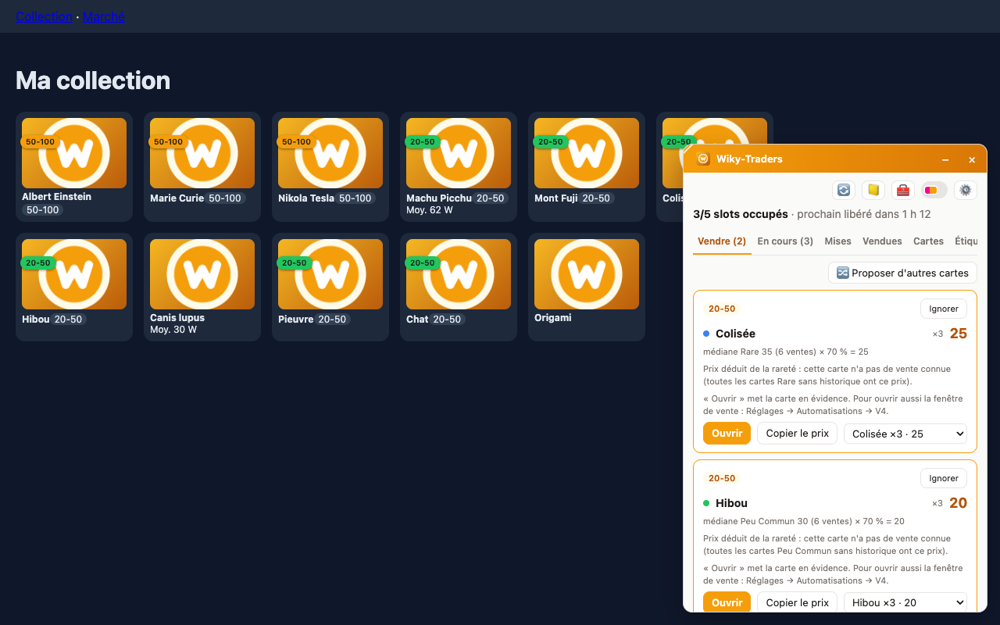
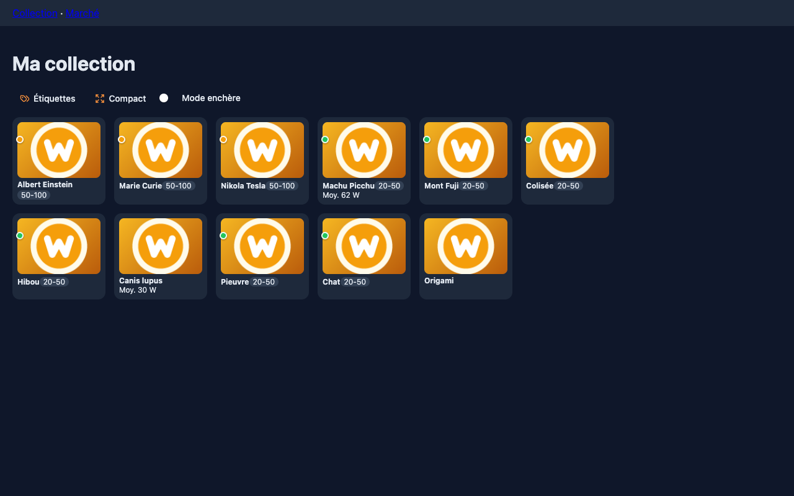
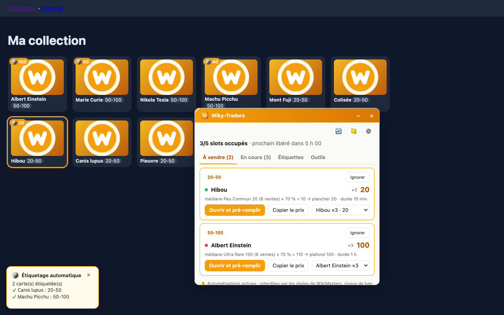

[← Sommaire de la documentation](README.md)

# Étiquettes

Les étiquettes du site (ex. `20-50`, `50-100`, « Mettre au Enchère ») sont la base de ta répartition : chaque règle réserve des slots à une étiquette.

## Règles par étiquette

Réglages → **Règles par étiquette**. Voir le détail des colonnes dans [Premiers pas](Premiers-pas.md#étape-2--tes-règles-par-étiquette).

- **Appartenance « étiquette du site »** : une carte appartient à la règle si elle porte l'étiquette.
- **Appartenance « plage de prix moyen »** : une carte appartient à la règle si son prix de référence est entre le plancher et le plafond (utile si tes cartes ne sont pas étiquetées).
- **Étiquette de secours** : quand une étiquette n'a plus de carte vendable, son slot passe à l'étiquette de secours.
- **Liste noire** : une carte par ligne, jamais proposée. Les favoris ne le sont jamais non plus.

## Étiquettes sur les cartes

Option **Étiquettes visibles sur les cartes** : sur chaque carte de la collection, les étiquettes s'affichent en haut, aux couleurs choisies sur le site.

- **libellés détaillés** : le nom de chaque étiquette (3 au plus, puis « +n ») ;
- **pastilles de couleur seulement** : de simples ronds, le nom au survol.

L'interrupteur à côté de ⚙️ dans la popup bascule entre les deux.

| Libellés | Pastilles |
| --- | --- |
|  |  |

## Étiquetage automatique

> ⚠️ Facultatif et désactivé par défaut : voir [Automatisations et risques](Automatisations-et-risques.md).

Range chaque carte dans l'étiquette dont la plage **plancher – plafond** contient son prix de référence (ex. 62 → `50-100`).

1. Réglages → Automatisations → **Étiquetage automatique sur le site** (confirmation).
2. Options : **Retirer les autres étiquettes gérées** (une carte ne garde qu'une plage). Les cartes sans prix connu ne sont pas modifiées.
3. Fenêtre **Étiquettes** : la liste des changements prévus (carte → étiquette), et pourquoi certaines cartes sont écartées.
4. **Lancer** :
   - par l'**interface** (sur la collection) : l'extension ouvre chaque carte et clique dans le menu des étiquettes ;
   - par l'**API** (option *Étiquetage par l'API*, plus fiable, depuis n'importe quelle page) : les mêmes écritures que la sélection multiple du site, limitées aux étiquettes.
5. Un toast affiche la progression avec un bouton **Arrêter**. Les favoris sont revérifiés avant chaque écriture ; l'étiquetage s'arrête seul si l'interface n'est pas reconnue.

