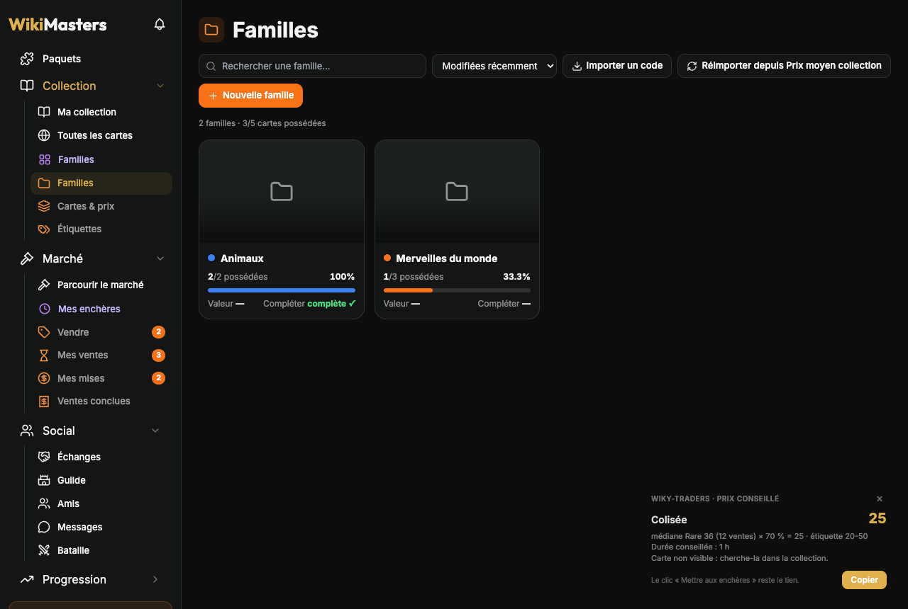

[← Sommaire de la documentation](README.md)

# Familles

Regroupe des cartes en **familles** (une série, un thème, un pays…), suis ta progression et complète-les au marché. Reprend la page « Familles » de l'extension *WikiMasters – Prix moyen collection*, en plus rapide.

## Ouvrir les familles

Menu **Wiky-Traders → Familles** dans la barre latérale (page `/collection?wiky=families`). Nécessite l'option *Intégration au site*.

## Tes familles de « Prix moyen collection »

Au premier lancement, toutes les familles enregistrées par l'autre extension sont **importées automatiquement** (cartes, couverture, une couleur chacune). Le bouton **Réimporter depuis Prix moyen collection** fusionne à nouveau par nom, sans doublon. Ensuite, Wiky-Traders garde ses familles dans son propre stockage : l'autre extension peut être désactivée.

## Accueil

- Une tuile par famille : mosaïque de 4 images (ou la couverture), couleur, cartes possédées / total, barre de progression, **valeur possédée** et **coût pour compléter** (médiane des ventes de chaque carte manquante).
- Recherche, tri (modifiées récemment, nom, progression, taille).
- **Nouvelle famille**, **Importer un code** (codes `F0.` / `F1.`, compatibles avec l'autre extension).

## Une famille

- **Renommer** : clic sur le nom (Entrée pour valider, Échap pour annuler) ; **couleur** : clic sur la pastille.
- **Exporter** un code de partage, **Supprimer** (avec annulation possible).
- Cases : progression, valeur possédée, coût pour compléter, cartes manquantes.
- Filtres **Toutes / Possédées / Manquantes**, recherche, rareté, tri (possédées d'abord, nom, rareté, prix).
- Sur chaque carte : ✓ ou nombre d'exemplaires, prix, **couverture**, **ajouter à une autre famille**, **retirer** (annulable).

La possession est **exacte et instantanée** : elle vient de ta collection connue, sans recherche par mots-clés ni carte « à vérifier ».

## Ajouter des cartes, vite

### Depuis la famille : « Ajouter des cartes »

1. Tape quelques lettres : la recherche part toute seule (titre ou catégorie, dans tout le catalogue), filtre de rareté, défilement infini.
2. Clique les cartes à ajouter ; **Maj + clic** sélectionne une plage ; **Tout sélectionner** prend tous les résultats. La sélection est gardée d'une recherche à l'autre.
3. **Ajouter N cartes**.

**Mes cartes de cette catégorie** ajoute d'un coup tes cartes d'une catégorie (fonctionne sans l'API).

### Depuis ta collection : sélection multiple

1. Sur la collection, clique **Sélectionner** (bouton du site) et coche tes cartes.
2. Dans la barre du site (« N cartes sélectionnées »), clique **Ajouter à une famille ▾**.
3. Choisis la famille ou **Nouvelle famille…**.

Le nombre de cartes ajoutées est comparé au compteur du site ; en cas d'écart, un message le signale.

### Depuis la fiche d'une carte

Le bouton **Famille** à côté du titre ajoute la carte ouverte à une famille.

## Pastilles de famille

Option *Familles sur les cartes* : un point de couleur par famille, en bas à gauche de l'image, sur les cartes de la collection, de « Toutes les cartes » et du marché. Survol : noms des familles ; clic : ouvre la famille.

## Marché des manquantes

Dans une famille, **Marché des manquantes** liste les enchères en cours de chaque carte manquante (la moins chère d'abord, jusqu'à 4 par carte, ✨ brillantes), avec le prix, le temps restant et le total pour tout compléter au moins cher. Une seule requête pour 150 cartes.

## Sans la lecture via l'API

La recherche dans le catalogue, les prix et le marché des manquantes demandent la *lecture via l'API* (Réglages → Automatisations) ; un message l'indique. L'ajout de tes propres cartes et l'import fonctionnent sans.
