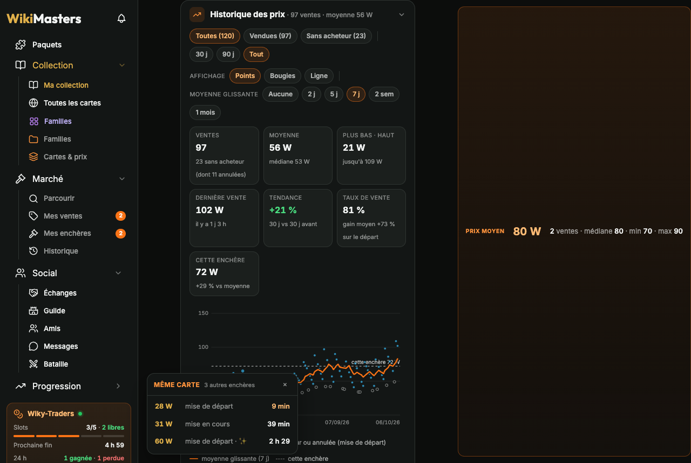
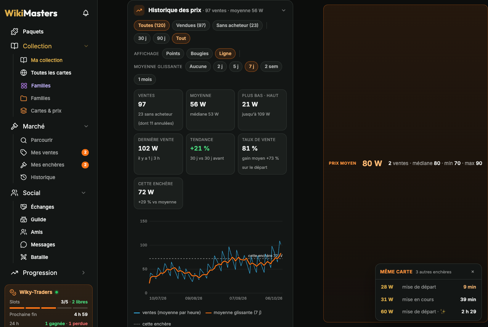
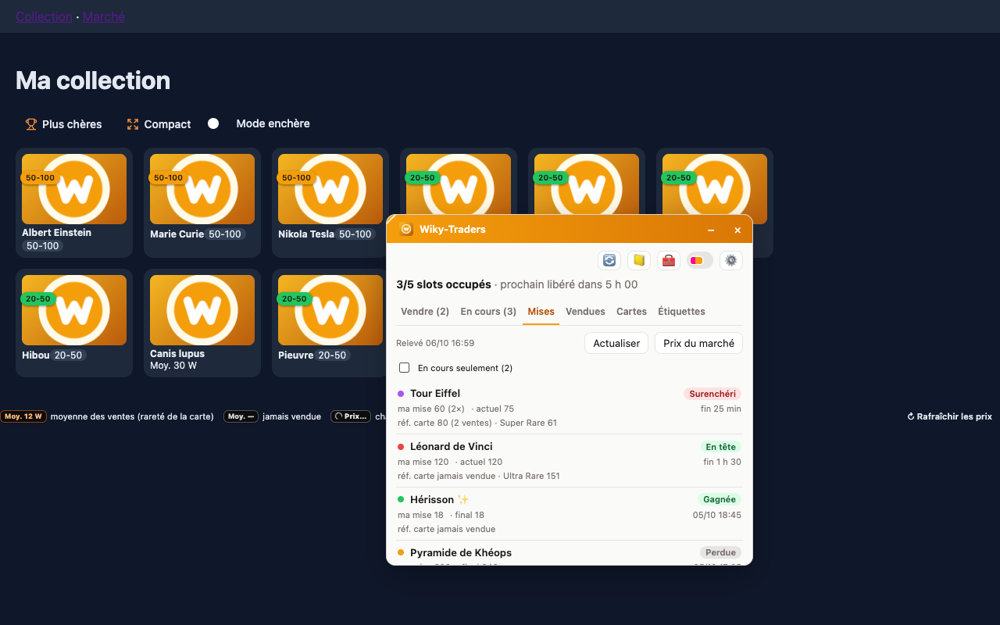
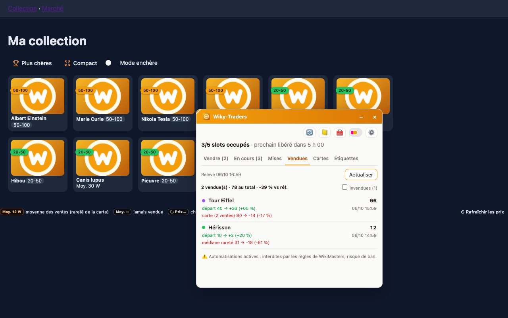

[← Sommaire de la documentation](README.md)

# Mises et ventes

Le menu **Marché** de la barre latérale ouvre directement les onglets du site, enrichis par Wiky-Traders :

| Onglet | Ce que Wiky-Traders ajoute |
| --- | --- |
| **Parcourir** | Sur chaque enchère, sous son prix : la **moyenne de la carte** et l'**écart** du prix actuel — vert sous la moyenne (≥ 10 % moins cher : bonne affaire), rouge au-dessus, gris au prix ; « Jamais vendue » sans référence. Aussi dans les autres onglets du Marché. |
| **Mes ventes** | Tes slots : les ventes du site et, à côté, une carte « Slot libre » par slot vide. Clic sur un slot libre : **Vendre** intégré (carte proposée, autre carte du slot, recherche, **carte au hasard** d'une étiquette, prix et durée modifiables). Avec l'option *Vendre depuis le classement*, mise en vente directe après confirmation ; sinon la carte s'ouvre avec prix et durée pré-remplis. |
| **Mes enchères** | Tes mises avec filtres **En cours / Historique / Toutes**, statut, ta mise, prix actuel ou final, temps restant, prix de la carte et écart ; relues à l'ouverture de l'onglet |
| **Historique** | Tes ventes terminées : statistiques en haut (vendues, invendues, taux de vente, total encaissé, gain moyen, écart moyen au prix de la carte, meilleure vente), filtres **Toutes / Vendues / Invendues**, recherche, tri ; pour chaque vente le prix de départ, le prix final, la moyenne de la carte et l'écart. « Liste du site » réaffiche la liste d'origine. |

## Page d'une enchère

| Points | Bougies | Ligne |
| --- | --- | --- |
|  |  |  |

Sous l'historique des mises, la section **Historique des prix** (dépliable, état mémorisé) :

- **chiffres clés** de la carte : ventes et enchères sans acheteur (dont annulées), moyenne et médiane, plus bas et plus haut, dernière vente, **tendance** (30 derniers jours contre les 30 précédents), **taux de vente** et gain moyen par rapport à la mise de départ, et l'écart de **cette enchère** à la moyenne ;
- **graphique** de l'évolution du prix, au choix (mémorisé) :
  - **Points** : un point plein par vente (prix final ; plus gros : brillante), un point vide par enchère **sans acheteur ou annulée** (à sa mise de départ) ;
  - **Bougies** : une bougie par jour — ouverture, clôture, plus haut, plus bas ; verte si le prix monte dans la journée, rouge s'il baisse ;
  - **Ligne** : les ventes reliées (moyenne des ventes d'une même heure) ;
- **moyenne glissante** réglable : aucune, **2 j, 5 j, 7 j, 2 semaines ou 1 mois** (moyenne des ventes de la période ; 7 j par défaut), en orange, toujours dessinée par-dessus ; les ventes sont en bleu, plus fines ; la mise de cette enchère en pointillé ; au survol, le détail de chaque point, bougie ou vente ;
- **filtres** : **Toutes / Vendues / Sans acheteur** et période (30 j, 90 j, tout) ;
- la **liste** de toutes les enchères terminées de la carte.

**Même carte** liste les autres enchères en cours de la carte (prix, mise de départ ou en cours, temps restant, ✨), de la moins chère à la plus chère ; clic pour l'ouvrir. C'est une fenêtre flottante : à droite du contenu s'il y a la place, sinon en bas à gauche. Relue toutes les 20 s, masquable (×).

## Mes ventes en cours

Fenêtre **Mes ventes** : chaque enchère avec sa carte, sa règle, son prix actuel et le temps restant.

Elles sont relues :

- **automatiquement via l'API** (si la lecture via l'API est activée) : au chargement d'une page du site, puis chaque minute tant qu'un onglet WikiMasters est visible, et en revenant sur l'onglet ;
- en ouvrant Marché → **Mes ventes** ;
- avec **↻** (bloc Wiky-Traders) ou 🔄 : via l'API, sinon l'extension va sur Marché → *Mes ventes* et relit la liste.

Une vente qui disparaît de la liste est comptée comme terminée (journal, prix final dans l'historique). Le nombre total de slots vient de tes réglages ou de « Mes ventes (2/5) » sur le site.

## Mes mises

*Nécessite la lecture via l'API.* Fenêtre **Mes mises** : les enchères des autres joueurs où tu as misé.

| Statut | Sens |
| --- | --- |
| En tête | Ta mise est la plus haute |
| Surenchéri | Quelqu'un a misé plus que toi |
| Gagnée / Perdue | Enchère terminée |
| Annulée | Enchère annulée par le vendeur |

La liste est **relue à chaque ouverture** de « Mes mises » (popup ou fenêtre du site). La case **En cours seulement** (mémorisée) n'affiche que les mises encore en jeu, en tête ou surenchéries.

Pour chaque mise : ta mise maximale, le prix actuel ou final, le temps restant et le **prix de la carte** (médiane de ses ventes) pour juger si tu paies trop cher. Le bloc Wiky-Traders résume les mises en cours et les résultats des dernières 24 h.

## Ventes conclues

*Nécessite la lecture via l'API.* Page **Ventes conclues** : tes ventes terminées, avec :

- le prix de départ et le prix final (gain en %) ;
- l'écart au **prix de la carte** (médiane de ses autres ventes) ou à la médiane de sa rareté ;
- le total et l'écart moyen ; option pour afficher les **invendues**.

## Cartes & prix

Page **Cartes & prix** : ta collection groupée par **famille**, **étiquette**, **catégorie** ou **rareté**, avec recherche. Un clic sur une carte affiche ses **enchères en cours**, de la moins chère à la plus chère (*Ouvrir* mène à la moins chère). Les cartes manquantes d'une famille apparaissent en premier.

## Journal

Outils → **📒 Journal** : toutes les ventes **proposées**, **créées** et **terminées**, avec par étiquette la part des ventes parties au prix de départ et un conseil pour ajuster ton %.

