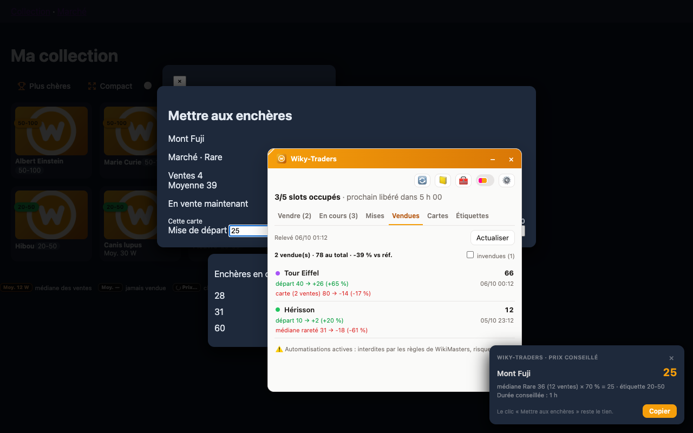
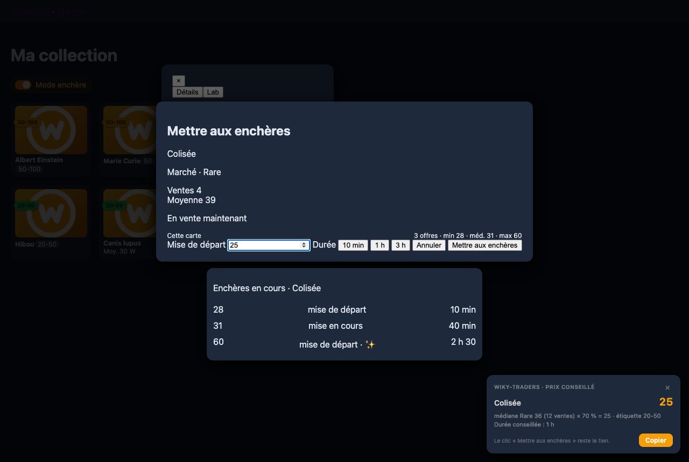

[← Sommaire de la documentation](README.md)

# Vendre

## La fenêtre « Vendre »

Ouvre-la d'un clic sur le bloc **Wiky-Traders** de la barre latérale (ou avec l'icône de l'extension). Chaque **slot libre** affiche :

- l'**étiquette** du slot (ex. `20-50`) ;
- la **carte proposée**, sa rareté (point coloré) et son nombre d'exemplaires (×3) ;
- le **prix conseillé** et le détail du calcul (« médiane Rare 36 (12 ventes) × 70 % = 25 ») ;
- la **durée conseillée** (selon tes paliers) ;
- une explication si le prix est une estimation.

| Bouton | Effet |
| --- | --- |
| **Ouvrir** | Va sur ta collection, met la carte en évidence et affiche le toast « prix conseillé ». Avec le pré-remplissage : ouvre aussi la carte et sa fenêtre de vente, prix et durée remplis. |
| **Copier le prix** | Copie le prix dans le presse-papiers. |
| Liste déroulante | Choisir une autre carte de la même étiquette. |
| **Ignorer** | Laisse ce slot vide jusqu'à la prochaine enchère. |
| **🔀 Proposer d'autres cartes** | Passe chaque slot à la carte suivante, sans doublon. |

Un slot vide est expliqué : cartes en favori, déjà en vente, bloquées par « garder au moins », ou aucune carte de cette étiquette.

## Quelle carte est proposée ?

1. Les cartes de l'étiquette du slot (ou de sa plage de prix).
2. Sauf : favoris, liste noire, cartes déjà en vente (sauf réglage contraire), exemplaires à garder.
3. Priorité aux cartes ayant **le plus de doublons**.
4. À doublons égaux : prix le plus haut, le plus bas ou aléatoire (réglage *À doublons égaux*).

## Dans la fenêtre « Mettre aux enchères » du site

Quand tu ouvres la mise en vente d'une carte connue :

- un **toast** rappelle le prix conseillé, son calcul et la durée conseillée ;
- avec la lecture via l'API : sous « Marché · Rare », un **résumé des offres en cours** de la carte (nombre, min, médiane, max) et, sous la fenêtre, la **liste de ses enchères en cours** (prix, mise de départ ou en cours, temps restant) ;
- avec le pré-remplissage : la mise de départ et la durée sont remplies une fois (une valeur que tu modifies n'est jamais écrasée).

Le clic **« Mettre aux enchères »** reste toujours le tien.

## Mode enchère (collection)

Sur la collection, l'interrupteur **Mode enchère** se trouve sur la ligne du titre, à côté de *Sélectionner*.

1. Active-le (la première fois, une confirmation rappelle les risques et active le pré-remplissage).
2. Survole une carte : contour orange et étiquette « Mettre aux enchères ».
3. Clique sur la carte : sa fenêtre **Mettre aux enchères** s'ouvre, **prix et durée remplis**.
4. Vérifie et clique toi-même sur **Mettre aux enchères**.

Le prix est celui de la règle d'étiquette de la carte, ou à défaut son prix moyen ; sans prix connu, la fenêtre s'ouvre avec le prix à saisir. Le bouton favori et le lien Wikipédia de la carte gardent leur rôle. Le mode est mémorisé dans le navigateur.

> Le Mode enchère clique sur le site à ta place : voir [Automatisations et risques](Automatisations-et-risques.md).

## Après la mise en vente

- La vente apparaît dans **Mes ventes** et dans le bloc Wiky-Traders (slots occupés).
- À la fin de l'enchère : alarme locale, **notification** (« Slot libéré : remets une carte 20-50 »), badge sur l'icône.
- Le **journal** garde la trace de la vente pour ajuster tes pourcentages.
